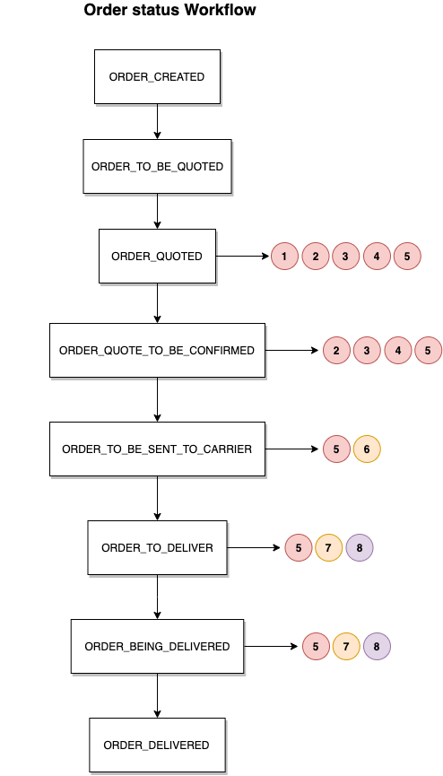
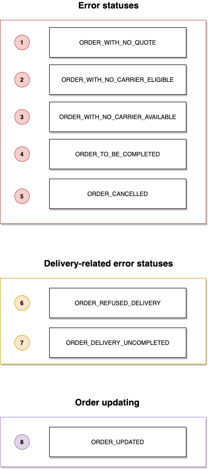

# Delivery status

During its life cycle, the order goes through different statuses.

### Order workflow

### List of possible order statuses

| Status                            | Description
|-----------------------------------|-----------------------------------------------------------------------
| `ORDER_CREATED`                   |The order has been registered on the woop side.
| `ORDER_UPDATED`                   |Order has been changed.
| `ORDER_TO_BE_QUOTED`              |The request for quote has been sent to the carriers.
| `ORDER_QUOTED`                    |Quotes received are being analyzed by the orchestration system. 
| `ORDER_QUOTE_TO_BE_CONFIRMED`     |Quote awaiting confirmation from carriers. 
| `ORDER_TO_BE_SENT_TO_CARRIER`     |Quote is selected and awaiting a delivery ID.
| `ORDER_TO_DELIVER`                |The order is ready to be delivered by the selected carrier.
| `ORDER_BEING_DELIVERED`           |Delivery of the order in progress. 
| `ORDER_DELIVERED`                 |The order has been delivered.
| `ORDER_WITH_NO_CARRIER_ELIGIBLE`  |No carrier selected during orchestration.
| `ORDER_WITH_NO_CARRIER_AVAILABLE` |No carriers available for the quotes sent. All responses are negative. 
| `ORDER_WITH_NO_QUOTE`             |No quotes received from the carriers requested.
| `ORDER_DELIVERY_UNCOMPLETED`      |Delivery in progress is not finalized. 
| `ORDER_TO_BE_COMPLETED`           |Order to complete with missing information.
| `ORDER_CANCELLED`                 |Order has been cancelled.
| `ORDER_REFUSED_DELIVERY`          |Order has been refused by carriers. 

### Returns and errors handling

